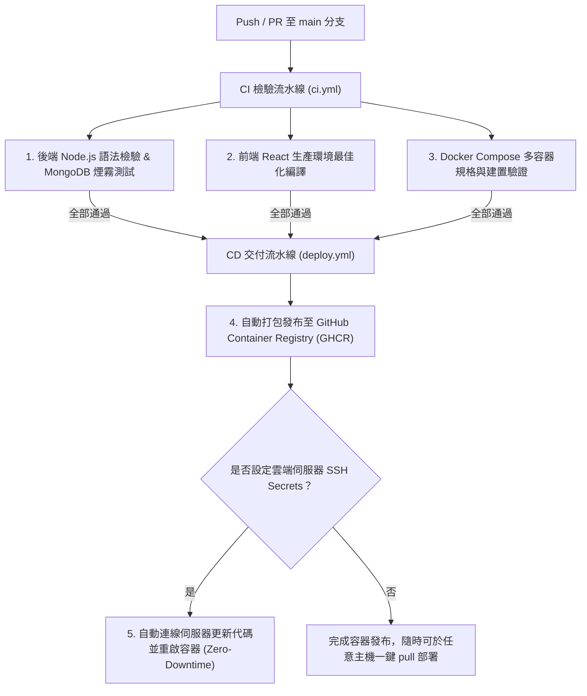

# 🚀 台灣夜市全端數位導覽系統 - GitHub Actions CI/CD 自動化流程指南

本專案已配置全自動化的 **GitHub Actions CI/CD 流水線**，讓您的每一次代碼推送（Push）與版本發布（Release）皆自動享有測試、建置、容器發布與雲端部署保護！

---

## 📋 流水線架構一覽



---

## 🛠️ 1. CI 持續整合 (Continuous Integration)

- **設定檔路徑**：[`.github/workflows/ci.yml`](file:///e:/git/shiwuzhuanti/.github/workflows/ci.yml)
- **觸發時機**：
  - 當有任何程式碼推送（`push`）至 `main`, `master`, `develop` 分支。
  - 當發起針對 `main` 分支的 Pull Request 時。
  - 支援在 GitHub 網頁上手動單擊執行（`workflow_dispatch`）。
- **自動執行的任務**：
  1. **後端自動化測試與資安驗證**：
     - 自動在 CI 環境拉起真實 `mongo:6.0` 服務容器。
     - 深度驗證 Node.js 核心程式碼語法（`node --check`）。
     - 驗證 NoSQL Injection 與 XSS 防禦機制正常運作。
  2. **前端編譯檢驗**：
     - 自動下載 NPM 模組依賴（具備快取加速）。
     - 執行 `npm run build`，確保無任何代碼中斷錯誤。
     - 自動打包 React 生成檔案並留存 7 天。
  3. **Docker 容器規格驗證**：
     - 校驗 `docker-compose.yml` 配置與 Volume 掛載語法。
     - 模擬雙容器建置流程（`FYPServer` 與 `website_client`）。

---

## 📦 2. CD 持續交付與部署 (Continuous Delivery & Deployment)

- **設定檔路徑**：[`.github/workflows/deploy.yml`](file:///e:/git/shiwuzhuanti/.github/workflows/deploy.yml)
- **觸發時機**：
  - 當程式碼合併或推送到 `main` 分支。
  - 當發布新版本標籤（例如 `git tag v1.0.0`）。
- **核心功能**：
  1. **自動發布官方 Docker 映像檔至 GHCR**：
     - 後端映像檔：`ghcr.io/<您的GitHub帳號>/nightmarket-server:latest`
     - 前端映像檔：`ghcr.io/<您的GitHub帳號>/nightmarket-client:latest`
     - 直接使用 GitHub 原生提供的 `GITHUB_TOKEN`，**無需任何額外第三方帳號設定**。
  2. **雲端伺服器無縫部署 (可選設定)**：
     - 若您在 GitHub 儲存庫設定了遠端主機的 SSH 憑證，流水線會在映像檔產出後，自動透過 SSH 登入主機執行：
       ```bash
       docker compose pull fypserver website_client
       docker compose up -d --remove-orphans
       ```
     - 若未設定 Secrets，系統會自動跳過遠端連線，並提示映像檔已就緒，保證工作流程綠燈完成。

---

## 🔐 3. 如何啟用雲端主機自動 SSH 部署（可選）

若您有購買雲端伺服器（如 AWS、GCP、DigitalOcean、Linode、阿里雲或自建主機）：

1. 開啟 GitHub 專案頁面：`https://github.com/Man-Fai33/shiwuzhuanti`
2. 點擊頂部 **Settings** ➔ 展開左側 **Secrets and variables** ➔ 選擇 **Actions**
3. 點擊 **New repository secret**，依序新增以下變數：

| Secret 名稱 | 說明範例 | 必填 |
| :--- | :--- | :---: |
| `REMOTE_HOST` | 伺服器 IP 或網域名稱 (如 `123.45.67.89`) | 是 |
| `REMOTE_SSH_KEY` | 連線伺服器使用的 SSH 私鑰 (`id_rsa` 或 `ed25519` 內容) | 是 |
| `REMOTE_USER` | 伺服器使用者名稱 (如 `ubuntu`, `root`, `deploy`) | 否 (預設 `root`) |
| `REMOTE_PORT` | SSH 通訊埠 (如 `22`) | 否 (預設 `22`) |
| `DEPLOY_PATH` | 專案在伺服器上的目錄路徑 (如 `/opt/shiwuzhuanti`) | 否 (預設 `/opt/shiwuzhuanti`) |

設定完成後，未來只要推送到 `main` 分支，GitHub 就會自動將最新程式碼部署上線！
