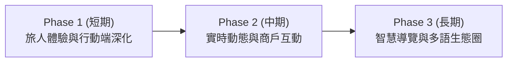

# 夜市好好行 🏮 系統全方位優化與演進規劃書
> **Taiwan Night Market Platform: Comprehensive System Optimization & Evolution Roadmap**  
> 核心受眾定位：**外縣市台灣遊客** ＆ **國際觀光客 (International Travelers)**

---

## 一、 平台定位與優化核心宗旨

本專案致力於打造全台灣最具**在地人情味**、**跨縣市交通最便利**、且對**外籍遊客最友善**的夜市生活文化與美食指南。

### 核心價值主張 (Core Value Proposition)
1. **去 AI 冰冷感，回歸真實在地溫度**：保留台灣夜市的招呼聲（「呷飽未？」、「逗陣來迺」）、燈籠紅溫暖美學與老饕真誠推薦。
2. **消弭外地與外國旅人的資訊不對稱**：
   - **外縣市旅客**：最在乎「大眾運輸轉乘（高鐵/火車/捷運/公車）」、「營業時段避坑（如台南花園夜市僅四六日營業）」、「停車場資訊」。
   - **外國觀光客**：最在乎「雙語完整度」、「菜色主要成分（豬/牛/素食/海鮮）」、「現金/行動支付準備」、「實用發音點餐小抄」。

---

## 二、 三階段演進時程藍圖 (Three-Phase Roadmap)

### 🚩 Phase 1：近期優化（旅人體驗深化與效能提速）— 1~2 週
* **PWA 與離線支援 (Progressive Web App)**：
  - 外國旅客在台灣經常面臨漫遊流量有限或夜市人潮密集處收訊不佳的情況。加入 Service Worker 與 PWA 快取，讓已載入的夜市地圖、小吃清單與點餐發音字卡在無網路時也能離線秒開。
* **旅人踩點收藏清單 (Traveler Wishlist / My Night Market Plan)**：
  - 在小吃與夜市卡片加入「❤️ 收藏」或「加入今晚覓食清單」，遊客出發前可勾選 3~5 樣必吃小吃，到了現場直接出示給店家看。
* **Web Speech API 點餐發音輔助**：
  - 在「點餐小抄（Traveler 101）」頁面加入發音朗讀按鈕，點擊即可播放標準發音（如「不要香菜」、「內用」、「微糖微冰」），外國人即使不會說也能直接按鍵出聲。
* **圖片 WebP 輕量化與 Lazy Loading**：
  - 夜市小吃照片自動壓縮轉換為 WebP 格式，首屏外圖片啟用原生 `loading="lazy"`，大幅降低首屏載入時間與漫遊流量消耗。

---

### 🚩 Phase 2：中期優化（實時動態、UGC 與營運功能）— 1~2 個月
* **即時壅塞度與人潮指數 (Live Crowd Level Indicator)**：
  - 根據時段或大數據分析呈現夜市人潮狀態：`🟢 悠閒好逛`（17:30-18:30）、`🟡 人潮適中`（18:30-19:30）、`🔴 尖峰排隊`（19:30-21:30），幫助旅人錯峰前往。
* **天氣與雨天備案提示 (Weather & Rainy-Day Notice)**：
  - 自動介接中央氣象署 API，提示目標夜市所在地今晚降雨機率，並標示該夜市是否有遮雨棚或室內美食地下街（如士林夜市 B1、寧夏夜市騎樓）。
* **遊客實拍打卡與真實評價 (UGC Community)**：
  - 開放遊客上傳探訪實拍照片與填寫評分，後台新增圖片審核機制，防止灌水與不雅內容。
* **認證攤位電子菜單與 QR Code 直達**：
  - 各攤位專屬 QR Code，遊客排隊時掃描即可預覽中英雙語菜單與價格，大幅縮短點餐等待時間。

---

### 🚩 Phase 3：長期演進（智慧觀光與國際生態圈）— 3~6 個月
* **AI 旅人行程管家 (Smart Itinerary Planner)**：
  - 依據旅客的「停留城市（如台北 3 日遊）」、「交通工具（捷運/租車）」、「同行人數與年齡（親子/情侶/獨旅）」、「預算（每人 NT$ 200）」智能生成最順暢的迺夜市一日路線推薦。
* **多語系拓展（日韓與東南亞語系）**：
  - 繼繁體中文與英文後，擴充日語（日本語）與韓語（한국어），深度吸引訪台主力觀光客群。
* **多幣別即時匯率換算 (Multi-Currency Converter)**：
  - 串接即時外匯 API，動態支援 USD、JPY、KRW、EUR、HKD、SGD 換算，讓各國旅人一目了然。

---

## 三、 代碼層級與系統架構具體優化對照表

| 模組 / 檔案路徑 | 目前狀態 | 建議優化項目 | 優先級 | 預期效益 |
| :--- | :--- | :--- | :---: | :--- |
| `website_client/src/Page/TravelGuide/index.js` | 已建立交通直達、常用發音與支付貼士 | 加入語音朗讀（Web Speech API）與行程打包 PDF 下載 | **高 (High)** | 外國遊客可直接播放點餐語音給老闆聽 |
| `website_client/src/Page/FoodList/index.js` | 支援食材禁忌標記與美元即時換算 | 增加「清真友善 (Halal Friendly)」、「無麩質 (Gluten Free)」精細標籤 | **高 (High)** | 照顧穆斯林與特殊飲食國際旅客 |
| `website_client/src/Page/NightMarket/index.js` | 支援城市快篩與捷運營業日警示 | 加入「附近 YouBike 租借站」與「公有停車場」空位查詢連結 | **中 (Medium)** | 照顧外縣市自駕與騎車背包客族群 |
| `website_client/src/Page/NightMarketPage/index.js` | 內嵌 OpenStreetMap 免金鑰地圖 | 整合 Google 街景跳轉或大眾運輸 Google Maps 導航 DeepLink | **高 (High)** | 點擊一鍵直接在手機開啟 Google Maps 路線規劃 |
| `FYPServer/routes/` (後端 API) | 採用基礎 MongoDB CRUD | 1. 引入 JWT 鑑權防護 2. 整合 `express-rate-limit` 防止惡意刷單 3. 加上 Swagger API 自動化文檔 | **高 (High)** | 大幅提升系統安全度與 API 規範化 |
| `FYPServer/models/` | 基礎欄位定義 | 擴充營業時段陣列（`openingHours: [{ day: 4, open: "17:00", close: "00:00" }]`） | **中 (Medium)** | 支援系統自動判斷「此時此刻是否營業中 (Open Now)」 |
| `website_client/public/manifest.json` | 預設 CRA 設定 | 設定完整的 PWA 離線圖標、主題色 `#C62828` 與離線快取 | **中 (Medium)** | 支援遊客「加到手機主畫面」，享有 App 級流暢體驗 |
| `website_client/package.json` | React 17 環境 | 升級 React 18，引進並發模式 (Concurrent Mode) | **低 (Low)** | 提升組件渲染效能與記憶體回收機制 |

---

## 四、 針對兩大客群的專屬功能深化清單

### 1. 面向「外縣市台灣遊客」的特色深化
- [x] **全台重要城市直覺切換**：台北市、台中市、台南市、高雄市、宜蘭縣（已完成）。
- [x] **營業時程警示**：特別標示台南花園夜市「四、六、日」限定營業，防止外縣市朋友長途跋涉撲空（已完成）。
- [ ] **高鐵/台鐵/客運無縫銜接指引**：在夜市詳情頁註記「從最近高鐵站/火車站搭幾號公車、車程幾分鐘、計程車約多少車資」。
- [ ] **周邊停車與夜間順遊景點**：推薦夜市周邊 500 公尺內公有停車場，以及逛完夜市後的散步景點（如饒河街彩虹橋、六合愛河之心）。

### 2. 面向「外國觀光客 (International Tourists)」的特色深化
- [x] **一鍵中英即時切換 (Traditional Chinese ⇄ English)**：所有導覽、夜市名稱、小吃介紹與回饋表單均雙語化（已完成）。
- [x] **美元金額估算 (USD Equivalent Estimate)**：在英文模式下，小吃價格自動標記 `~$2.0 USD`（已完成）。
- [x] **點餐語音小抄與發音拼音**：提供 `nèiyòng`、`wàidài`、`bùyào xiāngcài` 等發音對照（已完成）。
- [x] **食材禁忌標籤 (Dietary Tags)**：清楚標示 🥬 蔬食奶素、🐷 台灣豬、🍗 雞肉、🦐 海鮮（已完成）。
- [ ] **Google Maps 導航整合**：提供「Take Me There (以 Google 地圖導航)」按鈕，點擊直接拉起手機地圖導航。
- [ ] **免費公眾 Wi-Fi 與旅客服務中心位置**：標註夜市周邊 Taiwan Food / iTaiwan 免費 Wi-Fi 與遊客服務中心服務時段。

---

## 五、 維護與安全檢核規範 (Maintenance & Security Checklist)

1. **資料保護與隱私 (Security)**：
   - 杜絕明文密碼，會員登入後端全數採用 `bcrypt` 加鹽雜湊處理。
   - 圖片上傳目錄嚴格過濾副檔名（僅允許 `.jpg`, `.jpeg`, `.png`, `.webp`），禁止任何可執行腳本上傳。
2. **穩定性與備份 (Reliability)**：
   - 定期使用 `mongodump` 備份 MongoDB `fyp` 資料庫。
   - 保持 28 項 API 整合自動化測試持續綠燈（`npm test` / `node test_api.js`）。
3. **無障礙與跨裝置相容 (Accessibility & Responsiveness)**：
   - 支援 320px 手機小螢幕至 4K 桌面螢幕，抽屜選單與導覽列層級保證不遮擋。
